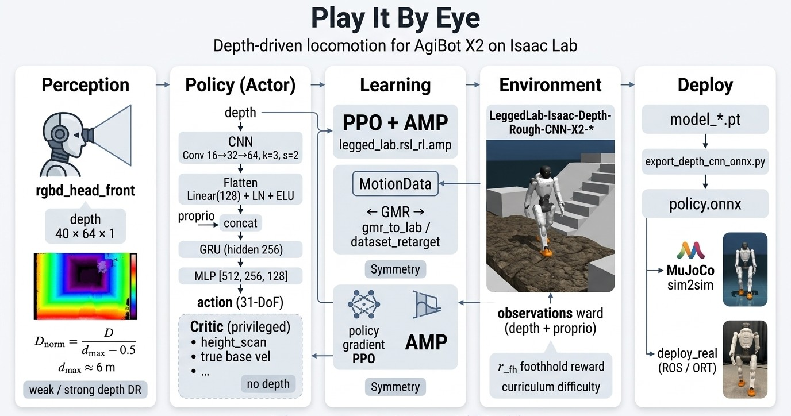

# Play It By Eye

[English](README.md) | [中文](README_zh.md)

[](https://docs.isaacsim.omniverse.nvidia.com/index.html)
[](https://isaac-sim.github.io/IsaacLab/main/index.html)
[](https://docs.python.org/3/whatsnew/3.12.html)
[](https://releases.ubuntu.com/20.04/)
[](https://opensource.org/licenses/Apache-2.0)

## Table of Contents

- [Overview](#overview)
- [Demo](#demo)
- [Architecture](#architecture)
- [Installation](#installation)
- [Usage](#usage)
  - [1. Prepare Motion Data (GMR → Lab)](#1-prepare-motion-data-gmr--lab)
  - [2. Train / Resume](#2-train--resume)
  - [3. Play](#3-play)
  - [4. Export ONNX](#4-export-onnx)
- [Citation](#citation)
- [Acknowledgement](#acknowledgement)

## Overview

**Play It By Eye** is an Isaac Lab extension for **depth-driven humanoid locomotion**. The actor sees with a head-mounted RGBD camera (no privileged `height_scan` on the policy), encodes depth with a **CNN → GRU → MLP** backbone, and is trained with **PPO + AMP** on rough / stair / slope terrains for **AgiBot X2** (31-DoF).

Built upon [zitongbai/legged_lab](https://github.com/zitongbai/legged_lab) (`feature/v3-migration`): Isaac Lab **v3.0.0**, upstream `rsl-rl-lib`, and in-repo AMP (`legged_lab.rsl_rl.amp`).

**Key features:**

- Asymmetric actor–critic: policy uses proprio + front depth (`40×64`); critic keeps privileged scans
- Custom recurrent depth policy: CNN → Linear(128) → GRU(256) → MLP → 31 actions
- AMP style prior from retargeted motion (GMR → Lab pkl)
- Rough terrain curriculum, foothold-aware rewards, optional symmetry augmentation
- Depth overlay play, ONNX export for MuJoCo sim2sim / real-robot packs

## Demo

Demo videos are published on [GitHub Releases](https://github.com/YiGongLily/play-it-by-eye/releases) (not shipped in `git clone`).

* Isaac Lab — depth-driven locomotion on rough / stair terrain (AgiBot X2):

https://github.com/YiGongLily/play-it-by-eye/releases/download/v0.1.0/demo_isaac.mp4"

* MuJoCo sim2sim:

https://github.com/YiGongLily/play-it-by-eye/releases/download/v0.1.0/demo_mujoco.mp4"

## Architecture



## Installation

### Prerequisites

- **Isaac Lab** `v3.0.0` (+ matching Isaac Sim) — [official install](https://isaac-sim.github.io/IsaacLab/main/source/setup/installation/index.html)
- NVIDIA GPU + CUDA; depth training is VRAM-heavy (prefer ≥ 24 GB for large `num_envs`)
- Git; large X2 mesh USD files may need a separate copy (see below)

### Clone and install package

```bash
git clone https://github.com/YiGongLily/play-it-by-eye.git
cd play-it-by-eye
conda activate <your_isaac_lab_env>
pip install -e source/legged_lab
pip install "rsl-rl-lib>=5.0.1"
```

Self-check:

```bash
python -c "import legged_lab, isaaclab; print('ok')"
```

### Robot USD assets

Small USD layers and MotionData `.pkl` ship with the repo. Two large X2 `*_base.usd` meshes (~129 MB each) may need to be synced into:

- `source/legged_lab/legged_lab/data/Robots/x2/usd/x2_ultra/configuration/x2_ultra_base.usd`
- `source/legged_lab/legged_lab/data/Robots/x2/usd/x2_ultra_simple_collision/configuration/x2_ultra_simple_collision_base.usd`

## Usage

End-to-end path:

```text
GMR retarget  →  dataset_retarget / gmr_to_lab  →  MotionData pkl
              →  train.py  →  play_with_depth.py  →  export_depth_cnn_onnx.py
```

Activate your Isaac Lab conda env first. Depth tasks always need `--enable_cameras`.

### 1. Prepare Motion Data (GMR → Lab)

1. Retarget human motion to X2 with [GMR](https://github.com/YanjieZe/GMR).
2. Convert GMR pickles to Legged Lab format with [`scripts/tools/retarget/dataset_retarget.py`](scripts/tools/retarget/dataset_retarget.py) (uses [`gmr_to_lab.py`](scripts/tools/retarget/gmr_to_lab.py) + Isaac FK for key bodies). Config: [`scripts/tools/retarget/config/x2_31dof.yaml`](scripts/tools/retarget/config/x2_31dof.yaml).

```bash
python scripts/tools/retarget/dataset_retarget.py \
  --robot x2 \
  --input_dir /path/to/gmr_pkls/ \
  --output_dir temp/lab_data/x2/ \
  --config_file scripts/tools/retarget/config/x2_31dof.yaml \
  --loop clamp \
  --headless
```

3. Move converted `.pkl` files under `source/legged_lab/legged_lab/data/MotionData/x2_31dof/...` and point `MotionDataCfg` in the env config at that folder (see existing `walk_and_run` layout and `JOINT_ORDER.md`).

### 2. Train / Resume

Main depth-CNN task IDs (X2):

| Role | Gym ID | Typical `experiment_name` |
| --- | --- | --- |
| Rough CNN (main) | `LeggedLab-Isaac-Depth-Rough-CNN-X2-v0` | `x2_depth_rough_cnn` |
| SpinFlat finetune | `LeggedLab-Isaac-Depth-Rough-CNN-X2-SpinFlat-v0` | (set via `--experiment_name`) |
| SpinRough finetune | `LeggedLab-Isaac-Depth-Rough-CNN-X2-SpinRough-v0` | (set via `--experiment_name`) |
| Corridor v1 | `LeggedLab-Isaac-Depth-Rough-CNN-X2-v1` | (set via `--experiment_name`) |

Play variants use the matching `...-Play-v0` / `...-Play-v1` IDs.

**Cold-start train** (from [`depth/config/x2/__init__.py`](source/legged_lab/legged_lab/tasks/locomotion/depth/config/x2/__init__.py)):

```bash
LOG="logs/nohup/XXX_$(date +%Y%m%d_%H%M%S).log"
nohup python scripts/rsl_rl/train.py \
  --task LeggedLab-Isaac-Depth-Rough-CNN-X2-v0 \
  --enable_cameras --headless --device cuda:0 \
  --num_envs 4096 --max_iterations 50000 --seed 42 \
  --experiment_name x2_depth_rough_cnn --run_name RUN_NAME \
  > "$LOG" 2>&1 &
echo "PID=$! LOG=$LOG"
```

**Resume / finetune:**

```bash
LOG="logs/nohup/XXX_$(date +%Y%m%d_%H%M%S).log"
nohup python scripts/rsl_rl/train.py \
  --task LeggedLab-Isaac-Depth-Rough-CNN-X2-v0 \
  --enable_cameras --headless --device cuda:0 \
  --num_envs 4096 --max_iterations 50000 --seed 42 \
  --experiment_name x2_depth_rough_cnn --run_name RUN_NAME \
  --resume --load_run RUN \
  --checkpoint CKPT \
  > "$LOG" 2>&1 &
echo "PID=$! LOG=$LOG"
```

Replace `RUN` / `CKPT` / `RUN_NAME` / `num_envs` as needed. Checkpoints land in `logs/rsl_rl/<experiment_name>/<run>/model_*.pt`.

### 3. Play

```bash
python scripts/rsl_rl/play_with_depth.py \
  --task LeggedLab-Isaac-Depth-Rough-CNN-X2-Play-v0 \
  --checkpoint logs/rsl_rl/x2_depth_rough_cnn/RUN/model_xxxxx.pt \
  --enable_cameras --device cuda:0 --num_envs 1 \
  --video --video_length 6000 --follow_cam
```

Videos are written under the run’s `videos/play/` directory. Add `--headless` when no display is available (keep `--enable_cameras` for depth).

### 4. Export ONNX

Export the trained CNN-GRU policy for sim2sim / deployment packs:

```bash
python scripts/rsl_rl/export_depth_cnn_onnx.py \
  --task LeggedLab-Isaac-Depth-Rough-CNN-X2-Play-v0 \
  --checkpoint logs/rsl_rl/x2_depth_rough_cnn/RUN/model_xxxxx.pt \
  --num_envs 1 --headless --device cuda:0 --enable_cameras \
  --num_align_steps 100
```

Synthetic-only alignment (no env rollout): add `--skip_env_dump`. Downstream MuJoCo closed-loop lives in the sibling `x2_depth_sim2sim` project.

## Citation

If you use this project, please cite **Play It By Eye** and the upstream **Legged Lab**:

```bibtex
@misc{play_it_by_eye,
  author       = {YiGongLily},
  title        = {Play It By Eye: Depth-Driven Humanoid Locomotion on Isaac Lab},
  year         = {2026},
  publisher    = {GitHub},
  journal      = {GitHub repository},
  howpublished = {\url{https://github.com/YiGongLily/play-it-by-eye}}
}
```

## Acknowledgement

This work is built upon [**Legged Lab**](https://github.com/zitongbai/legged_lab) by Zitong Bai ([v3-migration README](https://github.com/zitongbai/legged_lab/blob/feature/v3-migration/README.md)).

We also thank:

- [**Isaac Lab**](https://github.com/isaac-sim/IsaacLab) — simulation and RL infrastructure
- [**RSL-RL**](https://github.com/leggedrobotics/rsl_rl) — on-policy algorithms (`rsl-rl-lib`)
- [**GMR**](https://github.com/YanjieZe/GMR) — motion retargeting used before `gmr_to_lab` conversion
- [**InstinctLab**](https://github.com/project-instinct/instinctlab/) — Perlin-augmented rough terrain reference (via upstream Legged Lab)
- [**AMP_for_hardware**](https://github.com/Alescontrela/AMP_for_hardware) / upstream AMP design — style prior training patterns retained in this fork
